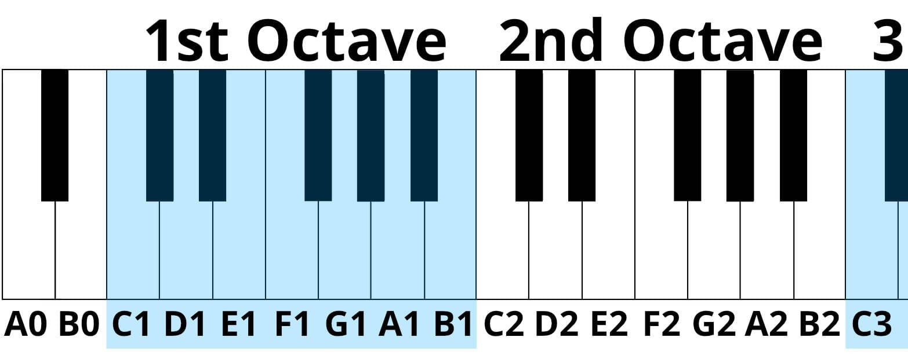

# Major or Minor?

You are a student at a university that combines music and technology. As part of the curriculum, you are assigned with recognizing basic chord shapes.

Write a program that, given a set of three musical notes, determines the root note and whether the chord is major or minor. Inputs **ONLY** contain either a major or a minor chord. Inputs are not necessarily in root inversion, and they can span multiple octaves.

## Context

The smallest musical unit is a semi-tone. A musical interval measures the number of semi-tones between any two notes. A (triad) chord contains a root note, a major third (3 semi-tones) or minor third (4 semi-tones), and a fifth (seven semi-tones).

Typically the note classes are represented as `[A, A#, B, C, C#, D, D#, E, F, F#, G, G#]`. To represent a note, we also need the octave, hence they are denoted as `A0` (the lowest A on a piano), or `A1`, an octave above that, etc.

This representation does not suffice for the computer scientist. Thus we represent note classes as `[0, 1, 2, 3, 4, 5, 6, 7, 8, 9, 10, 11]`. So `A0` is `0`, and `A1` is `12`, `A2` is `24`, and so on. Observe `0`, `12`, and `24` share the same note class (A) because the note classes are modulo 12.

## Input

The input is a single line. It contains 3 integers `a`, `b`, `c` (0 <= a < b < c <= 128) corresponding to 3 notes on a piano. 

> **HINT**: It is not necessarily true that the smallest number is the root note.

## Output

Print the root note class and whether the chord is major or minor.

### Examples

`Input: 0 4 7`
`Output: A major`

`Input: 1 5 8`
`Output: A# major`

`Input: 0 3 7`
`Output: A minor`

`Input: 1 4 8`
`Output: A# minor`

`Input: 11 2 6`
`Output: G# major`

`Input: 23 2 6`
`Output: G# major`

`Input: 21 40 49`
`Output: F# minor`
